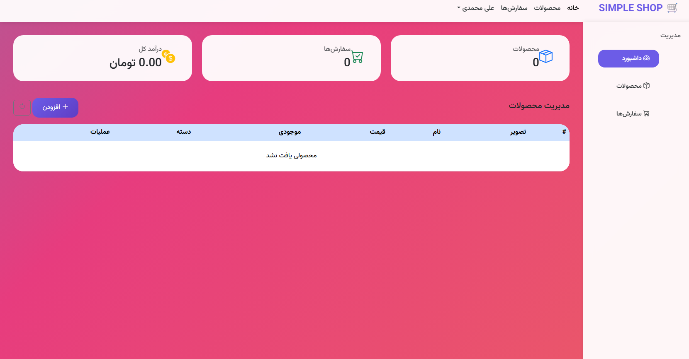
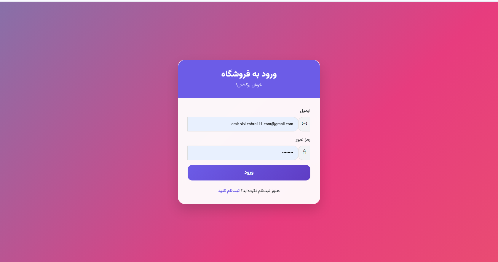
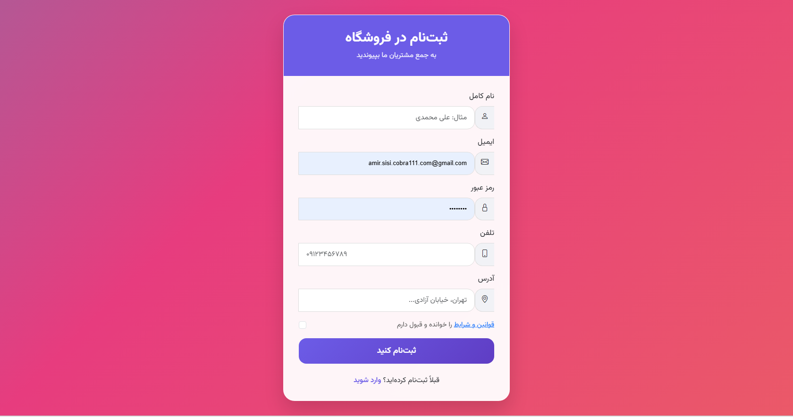
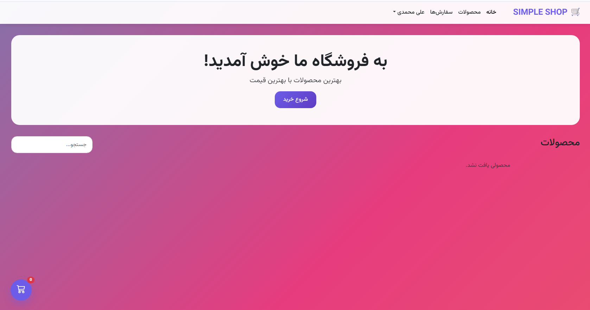

🛒 پروژه فروشگاه اینترنتی (Online Shop)
این پروژه یک وب‌اپلیکیشن فروشگاهی کامل و حرفه‌ای است با Node.js (Express) و MariaDB/MySQL.
هدف: پیاده‌سازی کامل یک فروشگاه آنلاین با احراز هویت، نقش‌های کاربری، مدیریت محصولات و سبد خرید.

📘 ساختار پوشه‌ها
text
project/
├── db/
│   └── connection.js          # اتصال و ایجاد جداول پایگاه داده
├── middleware/
│   └── auth.js                # middleware احراز هویت JWT و نقش‌ها
├── public/
│   ├── index.html             # داشبورد نقش‌محور (Admin/Customer)
│   ├── login.html             # صفحه ورود
│   ├── register.html          # صفحه ثبت‌نام
│   └── styles.css             # استایل‌های Bootstrap سفارشی
├── server.js                  # سرور اصلی Express
├── package.json               # پکیج‌های Node.js
├── .env                       # تنظیمات اتصال دیتابیس و JWT
└── README.md                  # مستندات پروژه
⚙️ نصب و اجرا
پیش‌نیازها
Node.js (v16+)
MariaDB/MySQL (یا XAMPP)
Git (اختیاری)
مراحل نصب
Bash
# 1. کلون یا دانلود پروژه
git clone <repo-url>
cd simple-online-shop

# 2. نصب پکیج‌ها
npm install

# 3. تنظیم دیتابیس (MariaDB/MySQL)
# در phpMyAdmin یا MySQL Workbench:
CREATE DATABASE shop_db;
# (جدول‌ها خودکار در db/connection.js ساخته می‌شوند)

# 4. ساخت فایل .env
cp .env.example .env
# ویرایش .env:
DB_HOST=127.0.0.1
DB_USER=root
DB_PASS=your_password
DB_NAME=shop_db
JWT_SECRET=your_super_secret_key
PORT=3000

# 5. اجرای سرور
npm start
# یا
node server.js
آدرس‌های تست
صفحه اصلی: http://localhost:3000
ثبت‌نام: http://localhost:3000/register.html
ورود: http://localhost:3000/login.html
تست API: http://localhost:3000/api/test
📚 جلسات توسعه
جلسه 1: طراحی و ERD
هدف: طراحی هدف پروژه و مدل‌سازی پایگاه داده
تحویل: ERD شامل جداول users, categories, products, carts, orders, order_items
ابزار: Draw.io، Lucidchart
جلسه 2: اتصال و APIهای پایه
هدف: اتصال به MariaDB و ایجاد endpointهای پایه
تحویل:
اتصال موفق به دیتابیس (/api/test)
API لیست محصولات (GET /api/products)
API جزئیات محصول (GET /api/products/:id)
ابزار: MySQL Workbench، Postman
جلسه 3: احراز هویت و امنیت
هدف: پیاده‌سازی ثبت‌نام و ورود کاربران
تحویل:
ثبت‌نام: POST /api/signup (با bcrypt hashing)
ورود: POST /api/login (JWT token generation)
ذخیره توکن: localStorage در frontend
صفحات: register.html, login.html
امنیت: JWT، bcrypt، validation
جلسه 4: نقش‌ها و داشبورد Role-Based
هدف: تفکیک نقش‌های مدیر (Admin) و کاربر (Customer) با داشبورد اختصاصی
تحویل:
Backend:
JWT Payload: { id, email, role }
Middleware: verifyToken, requireRole('admin')
API داشبورد: GET /api/dashboard (نقش‌محور)
مدیریت محصولات: POST/DELETE /api/admin/products
ثبت سفارش: POST /api/orders
خروج امن: POST /api/logout (Token Blacklist)
Frontend:
داشبورد ادمین: Sidebar، کارت‌های آمار (محصولات، سفارش‌ها، درآمد)، جدول محصولات، افزودن/حذف
داشبورد مشتری: Hero section، لیست محصولات، سبد خرید شناور (Floating Cart)، Offcanvas
Role-based UI: نمایش مشروط بر اساس localStorage.role
تست دستی:
ثبت‌نام کاربر عادی (role: 'customer')
ثبت‌نام/تغییر نقش ادمین (role: 'admin')
تست دسترسی: ادمین → مدیریت محصولات | مشتری → فقط خرید
تست سبد خرید: افزودن، حذف، ثبت سفارش
امنیت: Role-Based Access Control (RBAC)، Token Blacklist
🔐 API Documentation
عمومی (Public)
Method	Endpoint	Description
GET	/api/test	تست اتصال دیتابیس
GET	/api/products	لیست تمام محصولات
GET	/api/products/:id	جزئیات یک محصول
احراز هویت (Auth)
Method	Endpoint	Description	Response
POST	/api/signup	ثبت‌نام کاربر	{ token, user: { id, name, email, role } }
POST	/api/login	ورود کاربر	{ token, user: { id, name, email, role } }
POST	/api/logout	خروج (Token Blacklist)	{ message: 'خروج موفق' }
داشبورد (Dashboard)
Method	Endpoint	Role	Description	Response
GET	/api/dashboard	Admin	آمار + محصولات	{ role: 'admin', stats: { productCount, orderCount, totalRevenue }, products: [] }
GET	/api/dashboard	Customer	سفارشات کاربر	{ role: 'customer', orders: [] }
مدیریت محصولات (Admin Only)
Method	Endpoint	Description	Body
POST	/api/admin/products	افزودن محصول	{ name, description, price, stock, image_url, category }
DELETE	/api/admin/products/:id	حذف محصول	-
سفارشات (Customer)
Method	Endpoint	Description	Body
POST	/api/orders	ثبت سفارش از سبد	{ items: [{ id, name, price, qty, img }] }
🧪 تست دستی
1. تست اتصال و محصولات
Bash
# سرور را اجرا کنید
npm start

# تست اتصال
curl http://localhost:3000/api/test
# → { "success": true, "database_time": "2024-..." }

# تست محصولات
curl http://localhost:3000/api/products
# → [ { "id": 1, "name": "محصول 1", ... } ]
2. تست ثبت‌نام و ورود
Bash
# ثبت‌نام کاربر عادی
curl -X POST http://localhost:3000/api/signup \
  -H "Content-Type: application/json" \
  -d '{
    "name": "علی احمدی",
    "email": "ali@example.com",
    "password": "123456",
    "phone": "09123456789"
  }'
# → { "token": "eyJ...", "user": { "role": "customer" } }

# ثبت‌نام ادمین (role دستی در DB یا موقتاً در کد)
# → { "token": "eyJ...", "user": { "role": "admin" } }

# ورود
curl -X POST http://localhost:3000/api/login \
  -H "Content-Type: application/json" \
  -d '{
    "email": "ali@example.com",
    "password": "123456"
  }'
# → { "token": "eyJ...", "user": { "id": 1, "role": "customer" } }
3. تست Role-Based Access
Bash
# داشبورد ادمین (با token ادمین)
curl -X GET http://localhost:3000/api/dashboard \
  -H "Authorization: Bearer eyJ..."
# → { "role": "admin", "stats": { "productCount": 5, ... }, "products": [] }

# داشبورد مشتری
curl -X GET http://localhost:3000/api/dashboard \
  -H "Authorization: Bearer eyJ..."
# → { "role": "customer", "orders": [] }

# تلاش ادمین برای افزودن محصول (موفق)
curl -X POST http://localhost:3000/api/admin/products \
  -H "Authorization: Bearer eyJ..." \
  -H "Content-Type: application/json" \
  -d '{"name": "لپ‌تاپ", "price": 25000000, "stock": 10}'
# → { "message": "محصول ایجاد شد", "productId": 6 }

# تلاش مشتری برای افزودن محصول (ممنوع)
curl -X POST http://localhost:3000/api/admin/products \
  -H "Authorization: Bearer eyJ..." \
  -H "Content-Type: application/json" \
  -d '{"name": "تلفن", "price": 5000000}'
# → { "message": "دسترسی کافی نیست" } (403)
4. تست Frontend
باز کردنhttp://localhost:3000/register.html
ثبت‌نام → هدایت خودکار به login.html
ورود → هدایت به index.html
تست نقش‌ها:
ادمین: Sidebar چپ + کارت‌های آمار + جدول محصولات + دکمه‌های افزودن/حذف
مشتری: Hero section + محصولات + سبد شناور (Floating Cart)
تست سبد:
افزودن محصول به سبد → عدد badge بالا می‌رود
باز کردن سبد (Offcanvas) → نمایش اقلام + جمع کل
ثبت سفارش → پاک شدن سبد + پیام موفقیت
تست خروج → پاک شدن localStorage + هدایت به login
🛠️ ویژگی‌های پیاده‌سازی
Backend
احراز هویت: JWT با payload { id, email, role }
Role-Based Access: Middleware verifyToken + requireRole('admin')
امنیت: Token Blacklist (در حافظه)، bcrypt hashing، validation
پایگاه داده: Multiple queries، parameterized queries، error handling
API Design: RESTful، JSON responses، status codes مناسب
Frontend
UI/UX: Bootstrap 5، Glassmorphism، انیمیشن‌های CSS
Role-based: نمایش مشروط بر اساس localStorage.role
State Management: localStorage برای token، cart، user data
Components: Modal (افزودن محصول)، Offcanvas (سبد)، Floating Action Button
Responsive: Mobile-first، breakpoint‌های Bootstrap
امنیت
JWT: امضا با secret key، expiry 1h
Token Blacklist: خروج امن (توکن‌های logout‌شده قابل استفاده نیستند)
Input Validation: Frontend (HTML5) + Backend (if checks)
CORS: محدود به origin مشخص
SQL Injection: Parameterized queries
📦 ابزارها و تکنولوژی‌ها
Frontend	Backend	Database	Tools
HTML5, CSS3	Node.js, Express	MariaDB/MySQL	Postman
Bootstrap 5	JWT, bcrypt	MySQL Workbench	Git
JavaScript ES6+	dotenv	phpMyAdmin	VS Code
localStorage	CORS		
🚀 ویژگی‌های کلیدی
نقش‌های کاربری
Admin: مدیریت کامل محصولات (CRUD)، مشاهده آمار (محصولات، سفارش‌ها، درآمد)
Customer: مشاهده محصولات، سبد خرید، ثبت سفارش، مشاهده تاریخچه
سبد خرید
Floating Cart: دکمه شناور با badge تعداد اقلام
Offcanvas: نمایش جزئیات سبد با جمع کل
Persistence: ذخیره در localStorage
Validation: موجودی محصولات، محاسبه خودکار جمع
UI/UX
Glassmorphism: کارت‌های شفاف با backdrop-filter
Animations: Gradient shift، fadeInUp، hover effects
Icons: Bootstrap Icons، Font Awesome
Fonts: فونت‌های ایرانی (Vazirmatn، Yekan Bakh)
RTL: پشتیبانی کامل از فارسی
امنیت و عملکرد
Token Management: ذخیره، ارسال خودکار در headers، پاک‌سازی در logout
Error Handling: Frontend alerts، Backend status codes
Performance: Lazy loading، optimized queries
Accessibility: ARIA labels، keyboard navigation
📈 Roadmap آینده
نسخه 1.1 (Short-term)
Pagination: صفحه‌بندی محصولات و سفارشات
Search & Filter: جستجو و فیلتر محصولات
Product Categories: دسته‌بندی محصولات
Order Status: مدیریت وضعیت سفارشات (pending, shipped, delivered)
User Profile: ویرایش پروفایل کاربر
نسخه 2.0 (Mid-term)
Payment Gateway: درگاه پرداخت (زرین‌پال، به‌پرداخت)
File Upload: آپلود تصاویر محصولات
Email Service: ایمیل تأیید سفارش و ثبت‌نام
Admin Analytics: نمودارها و گزارش‌های پیشرفته
React/Vue: Refactor به Single Page Application
نسخه 3.0 (Long-term)
Microservices: تفکیک auth، products، orders
Redis Cache: Cache محصولات و sessions
Docker: Containerization و deployment
CI/CD: GitHub Actions، automated testing
Mobile App: React Native companion app
🤝 مشارکت‌کنندگان
نقش	نام	مشارکت
Backend Developer	[نام شما]	Express server، JWT auth، Database design
Frontend Developer	[نام شما]	Bootstrap UI، Role-based dashboard، Cart system
Database Admin	[نام شما]	MariaDB schema، Query optimization
DevOps	[نام شما]	Docker setup، Deployment pipeline
📄 لایسنس
text
MIT License

Copyright (c) 2024 Simple-Online-Shop

Permission is hereby granted, free of charge, to any person obtaining a copy...
💬 پشتیبانی
Issues
🐛 Bug Reports: مشکلات و خطاها
🚀 Feature Requests: درخواست ویژگی‌های جدید
📖 Documentation: سؤالات مستندات
کانال‌های ارتباطی
GitHub Issues: https://github.com/your-username/simple-online-shop/issues
Discord: #simple-shop-support
Email: support@simpleshop.ir
سؤالات متداول
چگونه ادمین بسازم؟ → در DB: UPDATE users SET role='admin' WHERE email='admin@example.com'
چرا سبد خالی است؟ → محصولات را از پنل ادمین اضافه کنید
خطای CORS؟ → app.use(cors({ origin: 'http://localhost:3000' }))
JWT منقضی شد؟ → دوباره login کنید (expiry: 1h)
🎯 نتیجه‌گیری
این پروژه فروشگاه اینترنتی کامل با احراز هویت پیشرفته، نقش‌های کاربری، مدیریت محصولات و سبد خرید پویا است.
آماده Production با امنیت بالا، UI مدرن و API کامل.

چالش‌های حل‌شده
✅ Role-Based Access Control (RBAC)
✅ JWT Token Management (ذخیره، ارسال، blacklist)
✅ Real-time Cart (localStorage + UI updates)
✅ Responsive Design (Mobile-first)
✅ Database Security (Parameterized queries)
✅ Error Handling (Frontend + Backend)
آمار پروژه
خطوط کد: ~1,200 (Backend + Frontend)
API Endpoints: 12 (Public + Auth + Admin + Customer)
Database Tables: 4 (users, products, orders, order_items)
Frontend Components: 8 (Navbar, Sidebar, Cards, Table, Modal, Offcanvas, etc.)

### جلسه ۵: مدیریت محصولات توسط ادمین
- فرم افزودن محصول با آپلود عکس
- ذخیره عکس در `public/uploads/`
- نمایش لیست محصولات در داشبورد ادمین
- تست: افزودن محصولی با موجودی ۱۰ و عکس

### جلسه ۶: نمایش محصولات برای کاربران
- صفحه لیست محصولات با کارت‌های زیبا
- کلیک روی محصول → صفحه جزئیات کامل
- دکمه "افزودن به سبد" در جزئیات
- استفاده از API `/api/products` و `/api/products/:id`